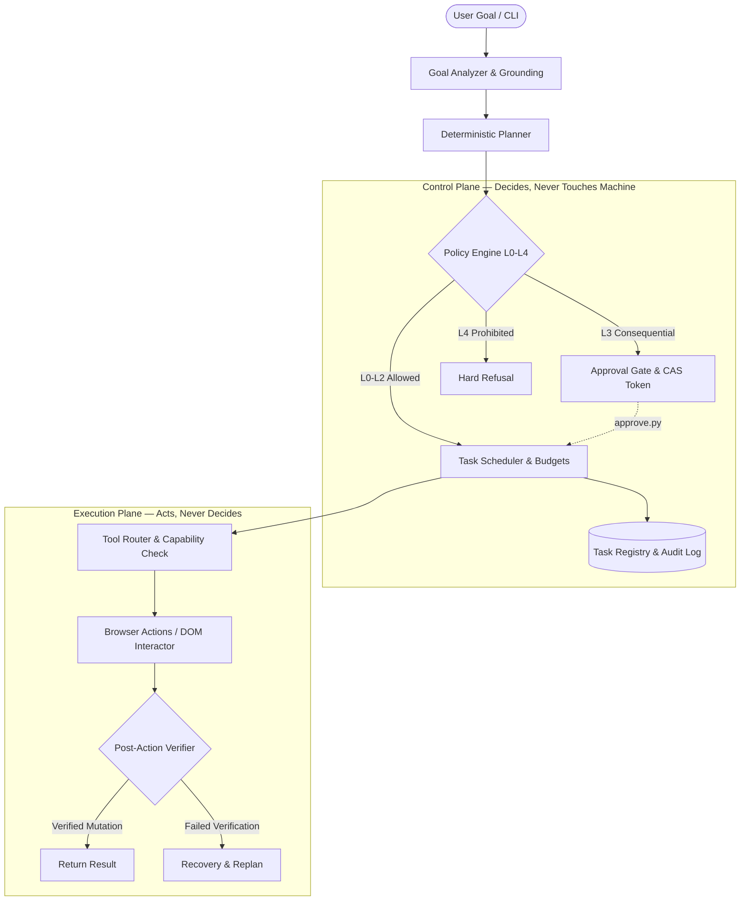

<div align="center">

# 🤖 Lakra 2.0 — Personal Browser Automation Agent

**Local-first, deterministic browser automation engineered with strict dual-plane isolation and L0–L4 policy enforcement.**

[](https://python.org)
[](https://github.com/nikhillakra2007-tech/personal-agent)
[](docs/reports/demo-v1.md)
[](docs/contracts/policy-schema.md)
[](LICENSE)

[Architecture](#-system-architecture) •
[Execution Roads](#-execution-roads) •
[Oracle Academy Suite](#-oracle-academy-automation-suite) •
[Safety & Policy](#%EF%B8%8F-policy--safety-model) •
[Quickstart](#-quickstart) •
[Design Intelligence](#-design-intelligence--uiux-pro-max) •
[Directory Structure](#-repository-structure) •
[Verification](#-testing--validation)

</div>

---

## 💡 Overview

**Lakra 2.0** is an autonomous, local-first browser automation agent built for reliability, security, and human oversight. Unlike naive automation scripts or unconstrained LLM web agents, Lakra adheres to a core engineering principle: **it never equates *"click happened"* with *"task succeeded"***.

Every action undergoes multi-phase ground verification, runtime resource checking, and explicit safety gating before and after execution.

### Key Highlights
- 🎓 **Autonomous Oracle Academy Suite**: Dedicated high-precision course & quiz automation engine (`oracle/`) featuring Gemini 3.8 Flash solving, frame-aware navigation, and 100% score answer harvesting.
- 🛡️ **Refusal-First Determinism**: Ambiguous or ungrounded instructions result in explicit refusal—never hallucinated actions.
- 🚦 **L0–L4 Policy Engine**: Enforces strict tiers ranging from read-only inspection (L0) to human-in-the-loop approval gates (L3) and hard blocks (L4).
- 🔄 **Dual-Plane Separation**: The **Control Plane** solely reasons and decides; the **Execution Plane** solely acts under strict capability tokens.
- 🔐 **Cross-Process Approvals**: Consequential actions halt in pending state with an atomic approval token until settled via an independent CLI process (`approve.py`).
- 📜 **Append-Only Auditing**: Every event, plan, transition, and verdict is preserved in a tamper-evident audit ledger.
- 🎨 **UI/UX Pro Max Intelligence**: Built-in design intelligence engine with 79 styles, 192 palettes, 74 font pairings, 119 UX guidelines, and 25 chart types.

---

## 🏛️ System Architecture

Lakra strictly isolates reasoning from side-effects across two architectural planes:



| Plane | Responsibilities | Primary Modules |
|---|---|---|
| **Control Plane** | Task registry, goal shaping, planning, policy evaluation, concurrency locks, approval settlements, audit ledger | `src/lakra/control/` |
| **Execution Plane** | Headless/headed browser controller, DOM observers, actions, mutation verification, filesystem/terminal wrappers | `src/lakra/execution/` |
| **Governance** | Real-time RAM/CPU/GPU sampling, token ledgers, failure backoff | `src/lakra/resources/` |

---

## 🛣️ Execution Roads

Lakra organizes browser workflows into specialized, robust execution pathways:

| Road | Description | Natural Language via `--goal` |
|---|---|:---:|
| **`observe`** | Navigates to target, takes a snapshot, and verifies content presence | ✅ Yes |
| **`follow`** | Grounds target link/button, performs navigation click, and verifies destination | ✅ Yes |
| **`click`** | Grounds unique clickable element, performs deterministic click, and verifies post-click mutation | ✅ Yes |
| **`search`** | Locates query input, types search term, triggers submit, and verifies result listings | ✅ Yes |
| **`form`** | Resolves form fields, populates inputs, and gates submission behind human approval | ⚙️ Explicit Flags |
| **`loop`** | Bounded iteration across repeating DOM structures (e.g. paginated links) | ⚙️ Explicit Flags |
| **`chain`** | Sequential multi-leg execution composing 2–4 roads (including `click` legs) | ⚙️ `--chain-file` |

---

## 🎓 Oracle Academy Automation Suite

Lakra includes a specialized, high-precision course & quiz automation engine located in [`oracle/`](oracle/):

* **🧠 Gemini 3.8 Flash Solver**: Context-aware SQL reasoning engine supporting single-choice and multi-choice ("Choose two", "Choose three") questions with 100% precision.
* **🖼️ Frame-Aware DOM Traversal**: Resolves APEX App `63000` (Page 15 & Page 190) whether rendered in top-level windows or embedded iframes.
* **🛡️ Zero-Premature-Submit Guard**: Questions 1 to $N-1$ strictly trigger `Submit Answer`/`Next`; `Complete Assessment` is only unlocked on the final question.
* **🔄 100% Score Guarantee**: Automatically harvests correct answers from "View Results" and executes automated retakes if score is under 100%.
* **⚡ Akamai DNS Pinning**: Employs Chromium `--host-resolver-rules` to bypass common router DNS drops (`ERR_NAME_NOT_RESOLVED`) on Oracle/Akamai CDN edge nodes.

👉 **Full documentation, scripts, and architecture details are available in [`oracle/README.md`](oracle/README.md).**

---

## 🛡️ Policy & Safety Model

Every plan step is scored against the **L0–L4 Safety Hierarchy**:

```
[L0: Read-Only]   → Allowed automatically (DOM snapshots, text reading, navigation)
[L1: Reversible]  → Allowed (typing, scrolling, standard element clicking)
[L2: Bounded]     → Allowed (checking boxes, selecting dropdowns)
[L3: Consequential]→ GATED: Halts execution, yields approval token, awaits human verification
[L4: Prohibited]  → REFUSED: Hard-blocked immediately (auth bypass, credential capture, CAPTCHA defeat)
```

### Human-in-the-Loop Approval Workflow
When an action reaches **L3** (e.g., submitting payment, ordering, publishing, deleting):
1. The agent enters `WAITING_APPROVAL` status and records an atomic approval token.
2. The user inspects the pending action via `scripts/approve.py --list`.
3. The user approves (`approve.py <token>`) or rejects (`approve.py --deny <token>`).
4. The executing task loop resumes immediately upon settlement.

---

## 🚀 Quickstart

### Prerequisites
- Python 3.11 or 3.12
- Chromium browser (installed via Playwright)

### 1. Installation
```powershell
# Clone the repository
git clone https://github.com/nikhillakra2007-tech/personal-agent.git
cd personal-agent

# Set up virtual environment
python -m venv .venv
.\.venv\Scripts\Activate.ps1

# Install package dependencies
pip install -e .
pip install pytest playwright psutil

# Install browser runtime
playwright install chromium
```

### 2. Basic Execution Examples

#### Natural Language Goal (Observe)
```powershell
python scripts/lakra_do.py --goal "Show me the records page at file:///c:/data/index.html" --yes
```

#### Natural Language Click & Verification
```powershell
python scripts/lakra_do.py --goal "Open file:///c:/data/page.html, click the Continue button, and verify Welcome" --yes
```

#### Natural Language Search & Verification
```powershell
python scripts/lakra_do.py --goal "Search for robotics at file:///c:/data/search.html and confirm results" --yes
```

#### Explicit Road Execution
```powershell
# Explicit Click Road
python scripts/lakra_do.py --road click --url "https://example.com" --text "Continue" --expect "Welcome" --yes

# Explicit Observe Road
python scripts/lakra_do.py --road observe --url "https://example.com" --expect "Example Domain" --yes
```

### 3. Human Approval Process
In a separate terminal while an L3 task is waiting:
```powershell
# List pending approval requests
python scripts/approve.py --list

# Approve the pending action token
python scripts/approve.py <APPROVAL_ID>
```

---

## 🎨 Design Intelligence & UI/UX Pro Max

This repository integrates the [UI/UX Pro Max](https://github.com/nextlevelbuilder/ui-ux-pro-max-skill) design intelligence engine inside [`.agents/`](.agents/) for UI/UX generation, design systems, and frontend interfaces:

- **Design Systems**: Generate full design systems for products or niches:
  ```powershell
  python .agents/skills/ui-ux-pro-max/scripts/search.py "fintech analytics dashboard" --design-system
  ```
- **Targeted Domain Queries**:
  ```powershell
  # Styles (bento, neo-brutalism, minimal, glassmorphism)
  python .agents/skills/ui-ux-pro-max/scripts/search.py "bento" --domain style

  # Color Palettes & Contrast
  python .agents/skills/ui-ux-pro-max/scripts/search.py "cyberpunk neon" --domain color

  # Typography & Pairings
  python .agents/skills/ui-ux-pro-max/scripts/search.py "editorial luxury" --domain typography

  # UX & Accessibility Guidelines
  python .agents/skills/ui-ux-pro-max/scripts/search.py "accessible button focus" --domain ux
  ```
- **Included Design Skills**: `ui-ux-pro-max`, `design-system`, `ui-styling`, `banner-design`, `brand`, and `slides`.

---

## 📁 Repository Structure

The project follows a systematic, modular organization where non-code directories adhere to a clean 2–3 file grouping:

```
personal-agent/
├── pyproject.toml              # Build & dependency metadata
├── README.md                   # Repository documentation & guide
├── PROFILE.md                  # GitHub Profile template (nikhillakra2007-tech)
│
├── .agents/                    # Design Intelligence & Agent Customizations
│   ├── AGENTS.md               # Workspace UI/UX directives & behavior rules
│   ├── rules/                  # Global/workspace rules (ui-ux-pro-max.md)
│   └── skills/                 # 7 installed skills (ui-ux-pro-max, design-system, etc.)
│
├── docs/                       # Specifications & System Documentation (2 files)
│   ├── VERSION                 # Current release version
│   ├── capability-matrix.md    # Capability & feature matrix (all roads including click)
│   ├── architecture/           # Architecture Blueprints (2 subfolders)
│   │   ├── system/             # Core architecture (3 files: overview, browser, testing)
│   │   └── governance/         # Policy & thresholds (3 files: consistency, policy, resources)
│   ├── contracts/              # Schema & Interface contracts (3 files)
│   ├── reports/                # V1 demo & real-world validation reports (3 files)
│   └── research/               # Agent research & competitive analyses (2 files)
│
├── scripts/                    # Primary Executable Tools (3 files)
│   ├── lakra_do.py             # Main CLI execution entry point
│   ├── approve.py              # Out-of-band approval settlement CLI
│   ├── demo_v1.py              # Full V1 acceptance test harness (30/30 checks)
│   ├── tools/                  # Auxiliary CLI utilities (2 files)
│   └── replays/                # Historical development slice verification harnesses
│
├── oracle/                     # Oracle Academy APEX Automation Suite
│   ├── README.md               # Dedicated documentation & architecture overview
│   ├── automate_oracle_course.py # Master autonomous course & quiz engine (v16)
│   ├── takeover_v2.py          # Interactive session takeover & solver
│   ├── manual_signin.py        # SSO session bootstrap for persistent context
│   ├── solvers/                # Gemini 3.8 Flash & multi-choice solver modules
│   ├── diagnostics/            # Frame & DOM inspection utilities
│   └── chains/                 # Lakra deterministic chain specs (oracle-academy.json)
│
├── specs/                      # Formal Feature Specifications
│   └── 001-lakra-v1/           # V1 formal spec, plan, tasks, and click road briefs
│
├── src/lakra/                  # Core Python Package
│   ├── control/                # Analyzer, Planner, Policy Engine, Scheduler, Store
│   ├── execution/              # Browser Controller, Observers, Actions, Tool Router
│   ├── models/                 # Model provider abstractions & deterministic proposal
│   └── resources/              # RAM, CPU, and GPU resource monitors
│
└── tests/                      # Full Pytest Test Suite (617 tests)
    └── fixtures/               # HTML fixture environments for browser test cases
```

---

## 🧪 Testing & Validation

Lakra maintains comprehensive test coverage verifying every state machine transition, guard, and DOM action:

```powershell
# Run the complete test suite (617 tests)
pytest tests -q

# Run Click road and Chain integration tests
pytest tests/test_click_road.py tests/test_click_shaping.py tests/test_chain_click.py tests/test_chain_status.py -q

# Run the full V1 end-to-end acceptance demo (30/30 PASS)
python scripts/demo_v1.py
```

---

## 📄 License

This project is licensed under the MIT License — see the [LICENSE](LICENSE) file for details.

---

<div align="center">
  <sub>Engineered by <a href="https://github.com/nikhillakra2007-tech">Nikhil Lakra</a>. Built for safe, deterministic agentic autonomy.</sub>
</div>
